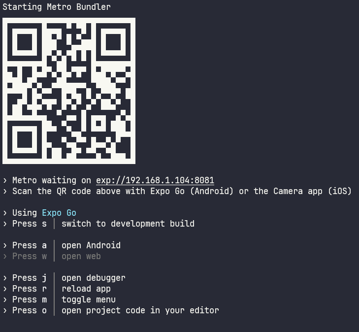
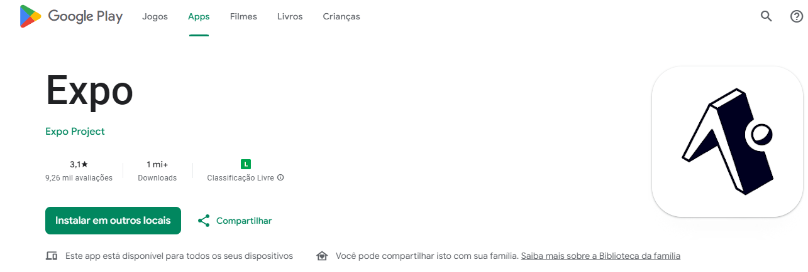
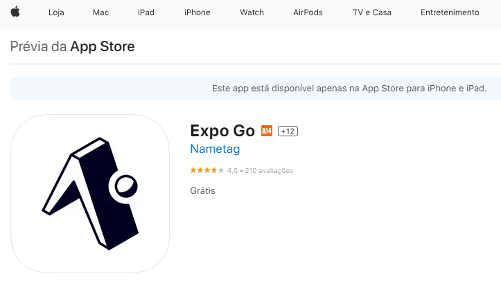

# Setup do projeto mobile

## Instalação

- Clone o repositório a partir do seguinte comando:

```node
git clone https://github.com/Startup-College/Mobile-catalog-lub-norte.git
```

- Após clonar o repositório, instale as dependências necessárias a partir do comando:

```node
npm install
```

## Iniciando o app

- Para ligar o servidor do expo utilize o comando:

```node
npx expo start
```

A seguinte tela irá aparecer



- Para iniciar o app, utilize seu celular baixando o app **Expo Go**

  
  

  - Android: Abra o app do Expo Go clique para escanear QR Code e escaneie o QR Code que apareceu quando você iniciou o servidor do expo.
  - iPhone: Abra o app da câmera do iPhone, escaneie o QR Code que apareceu quando você ligou o servidor do expo, ao escanear, irá aparecer um link na tela, clique nele e o app irá abrir automaticamente e começará o build do app.

- Android Studio

Alternativamente ao Expo Go, você pode utilizar o Android Studio para criar um emulador de dispositivo android para rodar seu app react-native.

- Ao ligar o servidor do expo, você (já com o android studio instalado e um emulador configurado) poderá apertar a tecla _a_, o emulador irá instalar o app do Expo Go e iniciar seu app.

> [!CAUTION]
> O uso do emulador exige muito da máquina, então utilize apenas se sua máquina tiver ao menos 8gb de RAM

# Conclusão

Você pode agora codar com o retorno visual a partir do seu dispositivo móvel.
Ao salvar os arquivos, o servidor gera um fast-reload que irá atualizar o app em seu dispositivo.
